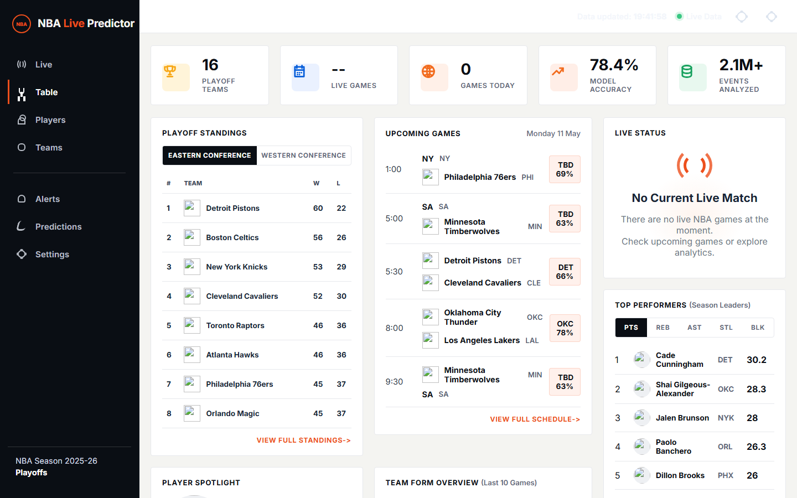

# NBA Live Predictor

A real-time NBA game analytics dashboard built with Flask and Socket.IO. It ingests live play-by-play data, runs an XGBoost shot-quality model and a PyTorch win-probability model, and renders a single-page dashboard with playoff standings, player/team profiles, and contextual news — all updating live via WebSocket.

The repository ships with synthetic training data and pre-trained model artifacts so the app is immediately runnable without a separate data pipeline.



## Features

- **Live scoreboard** — detects active NBA games via `nba_api` and polls every 3 seconds
- **Play-by-play tracker** — score, possession, latest event, shot context, shot quality, and win probability
- **Shot-quality model** — XGBoost regressor using distance, angle, defender distance, shot clock, and game situation
- **Win-probability model** — PyTorch network using score differential, time remaining, possession, fouls, and shot quality
- **Playoff dashboard** — standings, schedule, team form, player leaders, sentiment, and alerts
- **Per-game predictions** — `Run Model` button with a plain-English explanation of the pick
- **Player and team pages** — profile views with refreshable contextual news from ESPN
- **WebSocket push** — live prediction events emitted to all connected clients every 3 seconds

## Tech Stack

| Layer    | Libraries                                     |
| -------- | --------------------------------------------- |
| Backend  | Flask 3, Flask-SocketIO 5, simple-websocket   |
| Frontend | HTML, CSS, JavaScript (no framework)          |
| ML       | XGBoost, PyTorch, scikit-learn, pandas, NumPy |
| Data     | nba_api, ESPN public APIs                     |
| Tooling  | joblib, Matplotlib                            |

## Project Structure

```text
.
├── app.py                         # Entry point
├── requirements.txt
├── scripts/
│   └── train_models.py            # Regenerate model artifacts
├── app/
│   ├── main.py                    # Flask app factory + API routes + Socket.IO loop
│   ├── models/
│   │   ├── shot_quality.py        # XGBoost model wrapper + synthetic data generator
│   │   └── win_probability.py     # PyTorch model wrapper + synthetic data generator
│   ├── services/
│   │   ├── nba_live.py            # Live scoreboard/play-by-play adapter
│   │   ├── shot_quality_service.py# Converts play-by-play actions to model inputs
│   │   ├── league_analytics.py    # Playoff data, schedule, predictions, news, fallbacks
│   │   └── news_sources.py        # ESPN news fetcher
│   ├── static/
│   │   ├── dashboard.js           # SPA router, rendering logic, Socket.IO client
│   │   └── styles.css
│   └── templates/
│       └── index.html
└── data/
    ├── shot_quality_xgb.joblib    # Pre-trained XGBoost artifact
    ├── win_probability.pt         # Pre-trained PyTorch artifact
    └── synthetic_shot_quality_training.csv
```

## Quickstart

**Requirements:** Python 3.10+

```bash
# 1. Clone and set up a virtual environment
git clone https://github.com/saiompatro/NBA-AI.git
cd NBA-AI

python -m venv .venv
# macOS/Linux
source .venv/bin/activate
# Windows
.\.venv\Scripts\Activate.ps1

# 2. Install dependencies
pip install -r requirements.txt

# 3. (Optional) Regenerate model artifacts
python scripts/train_models.py

# 4. Start the server
python app.py
```

Open <http://127.0.0.1:5000>.

The server runs in debug mode by default. Set `debug=False` in `app.py` before deploying.

## API Reference

| Method | Endpoint                                                      | Description                                   |
| ------ | ------------------------------------------------------------- | --------------------------------------------- |
| GET    | `/`                                                           | Dashboard shell                               |
| GET    | `/api/prediction`                                             | Latest live or no-game snapshot               |
| GET    | `/api/analytics`                                              | Full analytics bundle                         |
| GET    | `/api/table`                                                  | Playoff standings                             |
| GET    | `/api/players`                                                | Playoff player stats                          |
| GET    | `/api/teams`                                                  | Playoff team data                             |
| GET    | `/api/schedule`                                               | Upcoming games                                |
| GET    | `/api/game-prediction?away=DET&home=CLE`                      | Matchup prediction with plain-English summary |
| GET    | `/api/news?type=team&team=DET&term=Detroit+Pistons&refresh=1` | Contextual ESPN news                          |
| GET    | `/api/shot-quality`                                           | Model metadata and feature importance         |
| GET    | `/teams/<slug>`                                               | Team profile page                             |
| GET    | `/players/<slug>`                                             | Player profile page                           |

**Socket.IO** — connect to the root endpoint; the server emits a `prediction` event every 3 seconds.

## Hash Routes (SPA)

The frontend is a single-page app driven by hash routes:

| Route                   | View                 |
| ----------------------- | -------------------- |
| `#/live`                | Live game tracker    |
| `#/table`               | Playoff standings    |
| `#/players`             | Player list          |
| `#/players/<slug>-<id>` | Player profile       |
| `#/teams`               | Team list            |
| `#/teams/<slug>`        | Team profile         |
| `#/predictions`         | Game prediction tool |
| `#/alerts`              | News alerts          |
| `#/settings`            | Settings             |

## Data Sources & Attribution

This project uses the following **public, unauthenticated** data sources. No API keys are required.

### nba_api

- **Package:** [`nba_api`](https://github.com/swar/nba_api) (MIT License) — a community Python client for the NBA Stats website
- **Endpoints used:**
  - `nba_api.live.nba.endpoints.scoreboard.ScoreBoard` — live scoreboard
  - `nba_api.live.nba.endpoints.playbyplay.PlayByPlay` — live play-by-play
  - `nba_api.stats.endpoints.scoreboardv3` — extended scoreboard
  - `nba_api.stats.endpoints.leaguedashplayerstats` — season player stats
  - `nba_api.stats.endpoints.leaguedashteamstats` — season team stats
  - `nba_api.stats.endpoints.playoffpicture` — playoff bracket picture
- **Data owner:** NBA Stats (`stats.nba.com`) — data is property of the NBA. Use is subject to [NBA Terms of Use](https://www.nba.com/tos).

### ESPN Public APIs

- **Endpoints used:**
  - `site.api.espn.com/apis/site/v2/sports/basketball/nba/scoreboard` — scoreboard fallback
  - `site.api.espn.com/apis/site/v2/sports/basketball/nba/news` — news articles
- **Data owner:** ESPN. These are undocumented public endpoints. ESPN may rate-limit or deprecate them without notice. Use respectfully.

### Synthetic Training Data

The ML models in this repository are trained on **synthetically generated data** (`data/synthetic_shot_quality_training.csv`). The generator (`app/models/shot_quality.py`) produces plausible shot-context distributions but does not use any proprietary tracking data (e.g. Second Spectrum, SportVU). For production-quality predictions, replace the synthetic generators with real historical play-by-play and tracking data.

## ML Models

| Model           | File                           | Algorithm         | Inputs                                                                            |
| --------------- | ------------------------------ | ----------------- | --------------------------------------------------------------------------------- |
| Shot Quality    | `data/shot_quality_xgb.joblib` | XGBoost regressor | distance, angle, defender_distance, shot_clock, game_situation                    |
| Win Probability | `data/win_probability.pt`      | PyTorch MLP       | score_diff, time_remaining, home_possession, home_fouls, away_fouls, shot_quality |

Both artifacts are pre-trained on synthetic data and included in the repository. Regenerate them at any time:

```bash
python scripts/train_models.py
```

## Contributing

Pull requests are welcome. For major changes, open an issue first to discuss what you'd like to change.

1. Fork the repo and create a feature branch
2. Run `python -m py_compile app.py app/main.py app/services/*.py app/models/*.py` as a quick syntax check
3. Open a pull request

## License

MIT — see [LICENSE](LICENSE) for details.

## Disclaimer

Predictions and analytics are experimental and generated from public feeds and prototype machine-learning models trained on synthetic data. They should not be used for betting, fantasy sports decisions, or any financial purpose.
